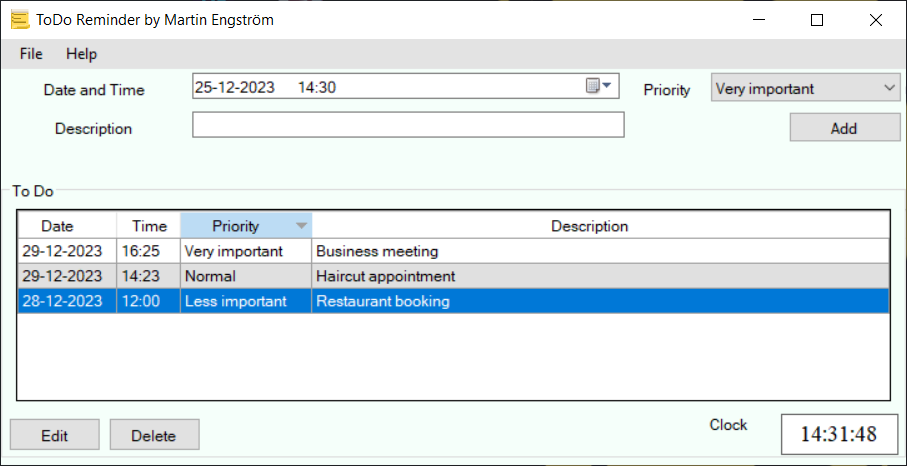

# ToDo Task Manager

## Description

ToDo Task Manager is a simple task management application built with C#.

## Features

- Add, edit, and remove tasks with deadlines, priorities, and descriptions.
- View a list of tasks with sorting options.
- Save and load tasks to and from .txt files.
- User-friendly graphical interface.

## Prerequisites

- [.NET Framework](https://dotnet.microsoft.com/download/dotnet-framework) installed.

## Getting Started

1. Clone the repository and build.
